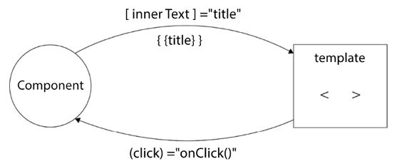
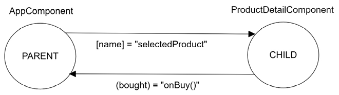

# Components

<!-- TOC -->
* [Components](#components)
  * [Overview](#overview)
  * [The `@Component` Decorator](#the-component-decorator)
  * [Creating and Registering a New Component](#creating-and-registering-a-new-component)
  * [Standalone Components](#standalone-components)
  * [Component Templates](#component-templates)
  * [Template - Component Bindings](#template---component-bindings)
    * [Overview](#overview-1)
    * [Property Binding](#property-binding)
    * [Class Binding](#class-binding)
    * [Style Binding](#style-binding)
    * [Event Binding](#event-binding)
    * [Two-way Binding](#two-way-binding)
  * [Component Inter-communication](#component-inter-communication)
    * [Overview](#overview-2)
    * [Input Binding](#input-binding)
    * [Output Binding](#output-binding)
  * [Local Reference Variables in Templates](#local-reference-variables-in-templates)
  * [Encapsulating CSS Styling](#encapsulating-css-styling)
  * [Change Detection Strategies](#change-detection-strategies)
  * [Component Lifecycle Hooks](#component-lifecycle-hooks)
    * [Initialisation with `OnInit` / `AfterViewInit`](#initialisation-with-oninit--afterviewinit)
    * [Destruction with `OnDestroy`](#destruction-with-ondestroy)
    * [Detecting Changes with `OnChanges`](#detecting-changes-with-onchanges)
  * [Accessing Child Components with `@ViewChild`](#accessing-child-components-with-viewchild)
<!-- TOC -->

## Overview

- _Components_ are the main representation of functionality within an Angular
  app.  They are the basic building blocks of the app, controlling different
  parts of the page called _views_.

- Components are responsible for the presentational logic of an Angular app
  and are organised in a hierarchical tree of components that can interact
  with each other.


## The `@Component` Decorator

- Components are represented by a class (typically called `XxxComponent`)
  that has a `@Component` decorator, with the following properties:
    - `selector` - a CSS selector that instructs Angular to load the
      component in the location that finds the corresponding tag in an HTML
      template.
    - `templateUrl` - the path to an external HTML that contains the
      template of the component.  Can also be provided inline by using the
      `template` property.
    - `styleUrls` - array of paths that point to external CSS style sheets
      for the component.  Can also be provided inline by using the `styles`
      property.

- Example component file for the root `AppComponent`:

    ```typescript
    @Component({
      selector: 'app-root',
      templateUrl: './app.component.html',
      styleUrls: ['./app.component.css']
    })
    export class AppComponent {
      title = 'Learning Angular';
    }
    ```


## Creating and Registering a New Component

- New components can be created using the `ng generate component <name>` CLI
  command.

- We typically want to run this inside the directory of an existing module,
  so that the new component is generated there, rather than in the root module.
    - The command also registers the new component with the module, by
      adding it to the module's `declarations` property.

- Components can be registered with _one and only one_ module.


## Standalone Components

- A component that isn't registered with a module is called a _standalone
  component_ - they import any angular artifacts that they need by
  themselves.

- Standalone components can be created by passing the `--standalone` flag to
  the `ng generate component` CLI command.

- Standalone components may be useful for quick prototyping or demo purposes,
  but you should migrate to modules to organise code better as the codebase
  grows.


## Component Templates

- To load a component into an existing HTML template, add the selector into
  the parent HTML template (e.g. by adding an element).

- To display data from the component class, we can use _interpolation_ to
  display a property value:

    ```typescript
    export class AppComponent {
      title = "Hello";
    }
    ```

    ```html
    <span>{{ title }}</span>
    ```


## Template - Component Bindings

### Overview

- Templates can be bound to components via a number of different mechanisms:
    - _Property Bindings_ - binding a template element's DOM property to a
      property on the component.
    - _Class & Style Bindings_ - binding a template element's CSS `class` or
      `style` to properties on the component.
    - _Event Bindings_ - triggering a method on the Component in response to
      an event on a template element.

- This two-way component interaction can be visualised as follows:

  


### Property Binding

- As an alternative to interpolating values, We can use _property binding_ to
  bind a component property to a DOM property of an element (not an HTML
  attribute):
    - Place the DOM property (the _target property_) inside square brackets
      on the element.
    - The variable on the right is the _template expression_.  It evaluates
      in the context of the component class, so if we want to use a string
      literal, it needs to be specified as `'title'`.

        ```html
        <!-- Set the value of the `innerText` DOM property to the
             value of the `title` component property -->
        <span [innerText]="title"></span>
        ```

- Angular templates define attributes in HTML to initialise a DOM property,
  then uses data binding to interact directly with the DOM property.

- To set an attribute of an HTML element, rather than a DOM property, use
  property binding with the `attr.` prefix:

    ```html
    <!-- Set the `aria-label` HTML attribute to the value of
         the `myText` component property -->
    <p [attr.aria-label]="myText"></p>
    ```


### Class Binding

- Element styles can be applied using either the `class` or `style`
  attributes of HTML elements.

- Angular can use _class binding_ to apply a single class to an HTML element
  using a form of _property binding_ with the `class.` prefix:

    ```html
    <!-- Apply the `star` class if `isLiked` is truthy -->
    <p [class.star]="isLiked"></p>
    ```

- To apply multiple classes simultaneously, use the following syntax:

    ```html
    <p [class]="currentClasses"></p>
    ```

    where `currentClasses` is one of:
    - A space-delimited string of class names - e.g. `'star active'`
    - An object with keys as class names and `boolean` values, e.g.:
      ```typescript
      currentClasses = {
        star: true,
        active: false
      };
      ```


### Style Binding

- As an alternative to _class binding_ we can use _style binding_ to set
  styles directly on elements, using the `style.` prefix with property binding:

    ```html
    <!-- Applies the `'greenyellow'` `color` style -->
    <p [style.color]="'greenyellow'"></p>
    ```

- Similar to _class binding_, multiple styles can be specified using:

    ```html
    <p [style]="currentStyles"></p>
    ```

  where `currentStyles` is one of:
    - A semicolon-delimited string of styles - e.g. `'color: greenyellow;
      width: 100px'`
    - An object with keys as style names and values, e.g.:
      ```typescript
      currentStyles = {
        color: 'greenyellow',
        width: '100px'
      };
      ```


### Event Binding

- Whereas _property binding_ displays data from the component in the
  template, getting data from the template back to the component class can
  be done using a technique called _event binding_.  This makes an event on
  an HTML element trigger logic in the component class.

- An _event binding_ listens for DOM events on the target HTML element and
  calls corresponding methods in the component class:

    ```typescript
    export class AppComponent {
      onClick() {
        // Handle click logic
      }
    }
    ```

    ```html
    <button (click)="onClick()">Click me</button>
    ```

- The event inside parentheses - `(click)` - is called the _target event_,
  and the expression on the right is called the _template statement_.


### Two-way Binding

*TODO - Complete section - see [Two-way Binding Docs][ref-docs-TwoWayBinding]


## Component Inter-communication

### Overview

- Angular components exist in a parent-child relationship - communications
  between parent and child components can be implemented using:
    - _Input Bindings_ - passing data _into_ a child component from the
      parent component.
    - _Output Bindings_ - communicating events from a child component to
      notify the parent component.


- This bidirectional communication between parent and child components is
  illustrated in the following diagram:

    


### Input Binding

- _Input bindings_ are used to pass data from a parent component to a child
  component - e.g. from a `ProductListComponent` to a `ProductDetailComponent`.

- Input bindings are declared using the `@Input()` decorator on the property
  in the child component, and then using [property binding](#property-binding)
  to bind the value from the parent component into the property on the child
  component:

    ```typescript
    // Input binding property declared in the child component
    export class ProductDetailComponent {
      @Input() name = '';
    }
    ```

    ```html
    <!-- Event binding in parent component template updates its own property -->
    <li (click)="selectedProduct = 'Webcam'">Webcam</li>

    <!-- Property binding in the parent component's template -->
    <app-product-detail [name]="selectedProduct"></app-product-detail>
    ```

- To pass static text or a literal value in the property binding, omit the
  square brackets, e.g.:

    ```html
    <app-product-detail name="this doesn't change"></app-product-detail>
    ```


### Output Binding

- The opposite of _input binding_ is _output binding_, where the child
  component wants to communicate to the parent that actions have taken place
  in the child.

- Output bindings are declared using the `@Output()` decorator on a property
  declared as `new EventEmitter()` in the child component.  Events from the
  child can be emitted to the property using `output.emit()`, then bound to
  in the parent using [event binding](#event-binding):

    ```html
    <!-- Child component template calls `buyClicked()` when the
         button is clicked -->
    <button (click)="buyClicked()">Buy Now</button>
    ```

    ```typescript
    export class ProductDetailComponent {
      @Output() bought = new EventEmitter();

      buyClicked() {
        // Emit a new event to the `bought` EventEmitter
        this.bought.emit();
      }
    }
    ```

    ```html
    <!-- Parent component template uses output binding to react to
         the `bought` event on the child component -->
    <app-product-detail
      [name]="selectedProduct" <!-- input binding from above -->
      (bought)="onBuy()">      <!-- output binding calls method in parent -->
    </app-product-detail>
    ```

    ```typescript
    export class ProductListComponent {
      // This is the method in the parent component that triggered by the
      // `bought` event in the child
      onBuy() {
        window.alert('You just bought a product');
      }
    }
    ```

- Data can be emitted through custom events by declaring the `@Output`
  property to be of a generic `EventEmitter` type:

    ```typescript
    export class ProductDetailComponent {
      @Output() bought = new EventEmitter<string>();

      buy() {
        this.bought.emit(this.name);
      }
    }
    ```

    ```html
    <!-- The parent component template can refer to the event as `$event` -->
    <app-product-detail
      [name]="selectedProduct"
      (bought)="onBuy($event)">
    </app-product-detail>
    ```


## Local Reference Variables in Templates

- _Template reference variables_ are declared by putting a name prefixed by
  `#` on a component's element in a template:

    ```html
    <app-product-detail
      #product
      [name]="selectedProduct"
      (bought)="onBuy($event)">
    </app-product-detail
    ```

- The reference can then be used elsewhere in the template to reference the
  child component, e.g. in interpolation expressions:

    ```html
    <span>{{ product.name }}</span>
    ```

- This approach can be used as an alternative to input or output bindings
  when we don't have control over the source code of the child component.


## Encapsulating CSS Styling

- Individual components can specify their own stylesheets to increase
  encapsulation and improve reusability of the component.

- _View encapsulation_ is how Angular manages CSS scoping within the
  component for both Shadow DOM-compliant browsers and those without support.

- The view encapsulation level can be changed by setting the `@Component`
  decorator's `encapsulation` property to one of the following values:
    - `Emulated` (default) - emulates native scoping in Shadow DOM, by
      sandboxing CSS rules under a specific selector pointing to the component.
    - `Native` - uses the native Shadow DOM encapsulation mechanism of the
      renderer.  Only works on browsers with Shadow DOM support.
    - `None` - no encapsulation provided.

- The preferred (and default) option is `Emulated`, as this ensures that
  component styles do not leak outside the component in which they are declared.


## Change Detection Strategies

- Change detection is the mechanism Angular uses internally to detect
  changes that occur in component properties, and to reflect those changes
  to the view.

- Change detection is triggered on various events, including:
    - Clicking on a button
    - Completion of an asynchronous request
    - `setTimeout()` or `setInterval()` methods are executed

- Every component has a _change detector_ that detects whether a change has
  been made in its properties:
    - The change detector then applies this change to the component's template.

- If components render a large amount of data, this default change detection
  mechanism may introduce performance bottlenecks.

- The change detection strategy for a component can be changed by setting
  the `@Component` decorator's `changeDetection` property:
    - `Default` - changes are triggered when a component is first loaded _and_
       again when properties change.
    - `OnPush` - changes aren't triggered on first load, only when
      properties are changed.


## Component Lifecycle Hooks

### Initialisation with `OnInit` / `AfterViewInit`

- The `OnInit` lifecycle hook implements the `ngOnInit()` method, called
  during component initialisation.

- When this method is called, all input bindings and data-bound properties
  have been set and can be used.

- `ngOnInit()` should be used in preference to the component's constructor,
  because properties aren't set at the time the constructor is called.

- `ngOnInit()` should also be used for more expensive initialisation, such
  as calling services to load data.

- The `AfterViewInit` lifecycle hook is called when both of the following
  have been completed:
    - The HTML template of the component has been initialised.
    - The HTML templates of all child components have been initialised.


### Destruction with `OnDestroy`

- The `OnDestroy` lifecycle hook implements the `ngOnDestroy()` method,
  called when the component is removed from the DOM tree of a web page.
  This can occur when:
    - Using structural [directives][ref-Directives] like `*ngFor` and `*ngIf`
    - Navigating away from a component using the [Angular router][ref-Router].

- Typical activities inside `ngOnDestroy()` include:
    - Resetting timers and intervals.
    - Unsubscribing from [observable streams][ref-Observables].


### Detecting Changes with `OnChanges`

- The `OnChanges` lifecycle hook is called when Angular detects that the
  value of an [input binding](#input-binding) has changed.

- The `ngOnChanges()` method takes a parameter of type `SimpleChanges` that
  contains a key for each input property that changes.  The value has
  `currentValue` and `previousValue` properties of the property:

    ```typescript
    export class ProductDetailsComponent implements OnChanges {
      ngOnChanges(changes: SimpleChanges): void {
        const product = changes['name'];
        console.log(
          `Changed from ${product.previousValue} to ${product.currentValue}`
        );
      }
    }
    ```

- `isFirstChange()` can be used to determine whether the change is the one
  that occurs when the value is first set (i.e. when the component is created).


## Accessing Child Components with `@ViewChild`

- If we want to access a child component from its parent, we need to create
  a property in the parent to reference it, using the `@ViewChild` decorator:

    ```typescript
    export class ProductListComponent implements AfterViewInit {
      @ViewChild(ProductDetailComponent) productDetail;

      ngAfterViewInit(): void {
        if (this.productDetail) {
          console.log(
            `ProductListComponent#ngAfterViewInit() - ${this.productDetail.name}`
          );
        }
      }
    }
    ```


<!-- References -->
[ref-Directives]: AngularDirectives.md
[ref-Observables]: AngularObservables.md
[ref-Router]: AngularRouting.md
[ref-docs-TwoWayBinding]: https://v15.angular.io/guide/two-way-binding
