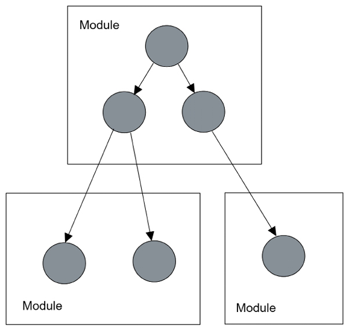

# Modules

<!-- TOC -->
* [Modules](#modules)
  * [Overview](#overview)
  * [The `@NgModule` Decorator](#the-ngmodule-decorator)
  * [Feature Modules](#feature-modules)
  * [Common Module Types](#common-module-types)
  * [Built-in Modules](#built-in-modules)
<!-- TOC -->

## Overview

- Angular modules are container for blocks of code that relate to a specific
  application domain (e.g. orders, customers) or user workflow (e.g.
  checkout, registration).

- Modules allow different areas of functionality to be developed
  and tested independently.

- Note that Angular modules are different from JavaScript modules - the
  latter refer to individual files whereas the former groups all artifacts
  of an area of the Angular app.

- All Angular apps contain at least a main module called `AppModule`,
  defined in `app.module.ts`.

## The `@NgModule` Decorator

- Modules are declared using the `@NgModule` decorator on the module class.
  It accepts an object with the following properties:
    - `declarations` - a list of the Angular components, directives and pipes
      that form part of the module.
    - `imports` - a list of other Angular modules whose declarations are
      needed by this module (e.g. `BrowserModule` for apps running in the
      browser).
    - `providers` - a list of _services_ that are provided by the module.
    - `bootstrap` - defines the components that are started up (bootstrapped)
      when this module is started.

- Example of a main `AppModule`:

    ```typescript
    @NgModule({
      declarations: [
        AppComponent
      ],
      imports: [
        BrowserModule,
        ProductsModule
      ],
      providers: [],
      bootstrap: [AppComponent]
    })
    export class AppModule { }
    ```

## Feature Modules

- Other modules (typically called _feature modules_) can be created
  alongside the main module using the CLI command `ng generate module
  <module-name>`.

- Modules typically form a hierarchy of features, as shown in the following
  diagram:
  

    - For a module to make components available for use by other modules, those
      components need to be _exported_ by the module, using the `exports` array
      of the `@NgModule` decorator:

        ```typescript
        @NgModule({
          declarations: [
            ProductListComponent
          ],
          imports: [
            CommonModule
          ],
          exports: [ProductListComponent]
        })
        ```

## Common Module Types

- Modules are used to group similar functionality and provide this to other
  modules. They can be further organised by:
    - The type of functionality provided.
    - How an Angular application loads them.

- Modules can be separated by the type of functionality provided, into:
    - _Core Modules_ (usually called _core_ and declared in `core.module.ts`) -
      these provide application-wide artifacts that don't fit into a specific
      module - e.g. top bars, footer components, custom
      loggers etc.

    - _Shared Module_ (usually called _shared_ and declared in `shared.
      module.ts`) - these contain Angular artifacts such as components,
      directives and pipes that are used in multiple feature modules.

- Modules can also be distguished between how the Angular framework loads them:
    - _Eager-loaded Modules_ - loaded at application startup - these are the
      modules that are explicitly declared in the `imports` array of another
      module.
    - _Lazy-loaded Modules_ - loaded on-demand, usually due to in-app
      navigation.  These aren't declared in the `imports` array, but have
      their own way of loading - see
      ['Routing & Navigation'][ref-RoutingAndNavigation].


## Built-in Modules

- Angular has a number of built-in first-party modules to provided common
  features, including:
    - `BrowserModule` - used to run Angular applications in the browser.
    - `CommonModule` - contains artifacts to support template syntax.
    - `FormsModule` / `ReactiveFormsModule` - allows building HTML forms for
      interacting with user input data - see ['Forms'][ref-Forms].
    - `HttpClientModule` - enables communication and data exchange over HTTP.
      See ['HTTP Client'][ref-HttpClient].
    - `RouterModule` - performs and handles navigation and routing.  See
      ['Routing & Navigation'][ref-RoutingAndNavigation].
    - `BrowserAnimationsModule` - cooperates with the _Angular Material_
      library to enable UI animations.


<!-- References -->
[ref-Forms]: AngularForms.md
[ref-HttpClient]: AngularHttpClient.md
[ref-RoutingAndNavigation]: AngularRouting.md
