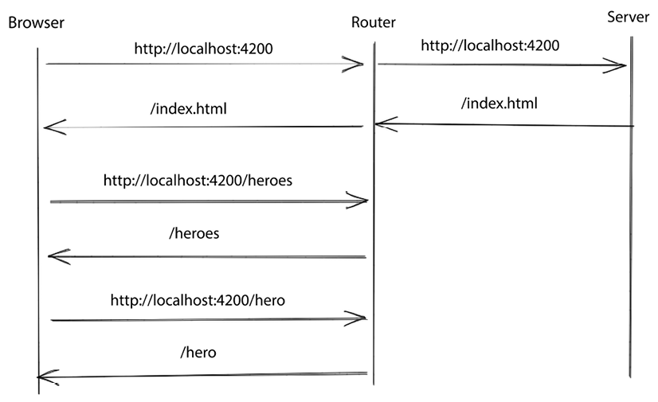

# Routing & Navigation

<!-- TOC -->
* [Routing & Navigation](#routing--navigation)
  * [The Angular Router](#the-angular-router)
  * [Setting up Routing](#setting-up-routing)
  * [Configuring Routing in Templates](#configuring-routing-in-templates)
  * [Handling Unknown and Default Routes](#handling-unknown-and-default-routes)
  * [Imperative Navigation](#imperative-navigation)
  * [Styling Router Links](#styling-router-links)
  * [Passing Parameters to Routes](#passing-parameters-to-routes)
  * [Controlling Route Access](#controlling-route-access)
  * [Prefetching Route Data with Resolvers](#prefetching-route-data-with-resolvers)
<!-- TOC -->

## The Angular Router

- Modern web applications with Angular are often referred to as _Single-Page
  Applications (SPAs)_ because navigation typically does not cause a full
  page reload (unlike traditional pages).

- Instead, the _Angular router_ handles changes between views and components
  purely on the client side, as illustrated below:

    


## Setting up Routing

- Angular applications use HTML `pushState` to support in-app navigation
  without requiring full page reloads.  This requires the base path to be
  specified using the `base` element in `index.html`:

    ```html
    <html>
      <head>
        <base href="/"
      </head>
    </html>
    ```

- The Angular router library contains `RouterModule` which needs to be
  imported into the root module using the special `forRoot(routes)` pattern:

    ```typescript
    @NgModule({
      // declarations, providers etc
      imports: [
        BrowserModule,
        RouterModule.forRoot(routes)
      ]
    })
    export class AppModule {}
    ```

- The `routes` argument passed to `forRoot()` is a `Routes` object - a list
  of objects that specify each route in the app:

    ```typescript
    const routes: Routes = [
      // This maps the `/products` path to `ProductListComponent`
      { path: 'products', component: ProductListComponent },
      // This is a 'wildcard' route that falls back to `PageNotFoundComponent`
      { path: '**', component: PageNotFoundComponent }
    ]
    ```


## Configuring Routing in Templates

- One of the main directives used by Angular routing is `router-outlet`,
  used as a placeholder for components activated with routing.  This is
  often done in the main `app.component.html` template:

    ```html
    <app-header></app-header>
    <router-outlet></router-outlet>
    <app-footer></app-footer>
    ```

- To add a link in a template, use the `routerLink` directive to specify the
  path to navigate to when the link is clicked:

    ```html
    <a routerLink="/products">Products</a>
    <a routerLink="/cart">Cart</a>
    ```


## Handling Unknown and Default Routes

- To handle the case where an unknown route is requested, it's possible to
  use a _wildcard_ route (`**`) to navigate to a 'page not found' component:

    ```typescript
    [ { path: '**', component: PageNotFoundComponent } ]
    ```

- To specify a _default_ route (to be used where the URL matches the base
  URL for the app), use an empty `path`.  It's also possible to redirect to
  another URL using the `redirectTo` property:

    ```typescript
    [ { path: '', redirectTo: '/products', pathMatch: 'full' } ]
    ```

- The order of routes determines their resolution order - more specific
  routes need to appear before less specific / wildcard / default routes.


## Imperative Navigation

- To navigate in code, the component containing the code needs to be
  injected with the `Router` service, from which the `navigate()` method can
  be called:

    ```html
    <button (click)="goHome()">Home</button>
    ```

    ```typescript
    export class PageNotFoundComponent {
      constructor(private router: Router) {}

      goHome() {
        this.router.navigate(['/']);
      }
    }
    ```


## Styling Router Links

- The Angular router mo dule exports the `routerLinkActive` directive, which
  can be used to change the style of a route when it is active.  This works
  similarly to [class binding][ref-ClassBinding].

- `routerLinkActive` accepts a list of class names, or a single class that's
  added when the link is active and removed when it's inactive:

    ```html
    <a routerLink="/products" routerLinkActive="active">Products</a>
    <a routerLink="/cart" routerLinkActive="active">cart</a>
    ```


## Passing Parameters to Routes

- A common scenario in application URL design is to navigate from a list
  page to a details page by appending an identifier to the end of the URL, e.g.:
    - List of products - `/products`
    - Product detail - `/products/<id>`, where `<id>` is the product identifier.

- This approach requires support for dynamic route parameters in the URL,
  which can be specified as placeholders in the `path`:

    ```typescript
    [ { path: 'products/:id', component: ProductDetailsComponent } ]
    ```

- The component can get access to the parameters by injecting the
  `ActivatedRoute` service, which contains the `paramMap` observable.  This
  can be subscribed to in order to get route parameter values:

    ```typescript
    this.product$ = this.route.paramMap.pipe(
      switchMap(params => {
        return this.productService.getProduct(Number(params.get('id')));
      })
    );
    ```

- Alternatively, parameters can be passed using query parameters, in which
  case they become available via the `queryParamMap` observable.

- If we're sure a component isn't going to be reused, it's possible to use
  the `ActivatedRouteSnapshot` to get the current value, rather than an
  observable.


## Controlling Route Access

- To control access to routes, use a _guard_, which can be any of the
  following types:
    - `canActivate` - controls whether a route can be activated.
    - `canActivateChild` - controls access to child routes of a route.
    - `canDeactivate` - controls whether a route can be deactivated (when
      it's navigated away from).
    - `canLoad` - controls access to a route that loads a lazy-loaded module.
    - `canMatch` - controls access to the same route path based on
      application conditions.

- To create a `canActivate` guard, create an instance of `CanActivateFn`:

    ```typescript
    // Simulates whether the user is logged in or not
    const loggedIn = false;
    export const authGuard: CanActivateFn = () => loggedIn;
    ```

    ```typescript
    const routes: Routes = [
      {
        path: 'cart',
        component: CartComponent,
        canActivate: [authGuard]
      }
    ]
    ```

- To create a `canDeactivate` guard, create an instance of `CanDeactivateFn`,
  with a type parameter specifying the component away from which navigation
  is being attempted:

    ```typescript
    export const checkoutGuard: CanDeactivateFn<CartComponent> = () => {
      const confirmation = confirm('Are you sure you want to leave?');
      return confirmation;
    }
    ```

    ```typescript
    const routes: Routes = [
      {
        path: 'cart',
        component: CartComponent,
        canDeactivate: [checkoutGuard]
      }
    ]
    ```


## Prefetching Route Data with Resolvers

- If a detail child fetches data from a remote source, it's possible that
  there may be a delay navigating to the route as the data is fetched.  This
  can be avoided by using _prefetching_ to make an earlier request for the data.

- This uses an Angular _resolver_ to prefetch the data and return the
  necessary observable:

    ```typescript
    export const productDetailResolver: ResolveFn<Product> =
      (route: ActivatedRouteSnapshot) => {
        const productService = inject(ProductsService);
        const id = Number(route.paramMap.get('id'));
        return productService.getProduct(id);
    }
    ```

    ```typescript
    const routes: Routes = [
      {
        path: 'products/:id',
        component: ProductDetailComponent,
        resolve: productDetailResolver
      }
    ]
    ```


<!-- References -->
[ref-ClassBinding]: AngularComponents.md#class-binding
