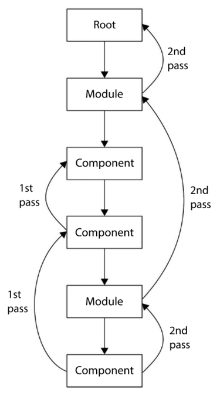
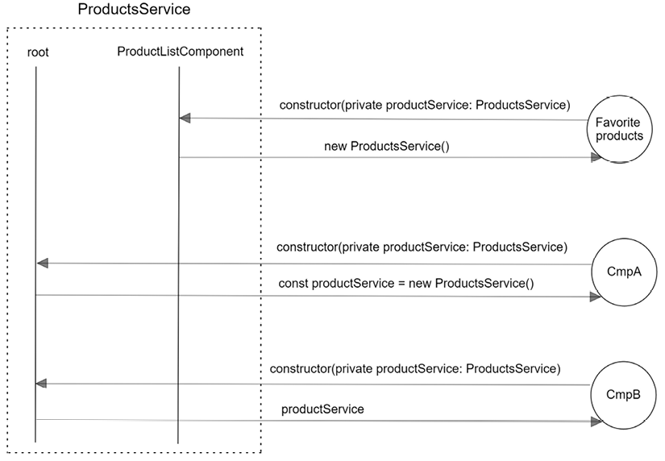

# Services & Dependency Injection

<!-- TOC -->
- [Services \& Dependency Injection](#services--dependency-injection)
  - [Overview](#overview)
  - [Creating Services](#creating-services)
  - [Using Dependencies in Consumers](#using-dependencies-in-consumers)
  - [Providing Dependencies in the Root Injector](#providing-dependencies-in-the-root-injector)
  - [Providing Dependencies in Other Injectors](#providing-dependencies-in-other-injectors)
  - [Injecting Services in the Component Tree](#injecting-services-in-the-component-tree)
  - [Restricting Provider Lookup](#restricting-provider-lookup)
  - [Overriding Providers in the Injector Hierarchy](#overriding-providers-in-the-injector-hierarchy)
<!-- TOC -->

## Overview

- _Dependency injection_ is the mechanism by which code entities are passed
  their dependencies - e.g. providing _services_ to _components_.

- Injection of dependencies in Angular is the responsibility of an entity
  called the _injector_, which is responsible for instantiating and
  bootstrapping the required dependencies ready for use when injected into a
  consumer.

- This decouples the responsibility of creating the dependency from the
  consumer of that dependency - all the consumer needs to know about is the
  interface implemented by the dependency.

## Creating Services

- Services are created by running the `ng generate service <service-name>`
  command from the Angular CLI.

- An Angular service is a TypeScript class marked with the `@Injectable`
  decorator containing an object with a single property - `providedIn`:

    ```typescript
    @Injectable({
      providedIn: 'root'
    })
    export class ProductsService { }
    ```

- Angular services are available application-wide by default, so aren't added
  to modules by default. Instead, they are registered with an _injector_
  such as the `root` injector in the example above.

## Using Dependencies in Consumers

- Consumers who want to have a dependency injected specify this using
  _constructor injection_ - the dependency is referenced in the consumer's
  constructor:

    ```typescript
    export class ProductServiceConsumer {
      constructor(private productService: ProductsService) {}
    }
    ```

## Providing Dependencies in the Root Injector

- The root injector returns a singleton instance of the type represented by each
  dependency. It maintains a list of all dependencies that the application
  needs.

- When a component or other artifact needs to have a dependency injected,
  the injector first checks to see whether one has already been created:
    - if not, a new instance is created, returned for use, and kept for
      further use.
    - if it has already been created, then that instance is returned.

- So, for exmaple, the above `ProductsService` can be injected by both
  `ProductListComponent` and `ProductDetailComponent` and they use the same
  instance.

- When creating a service, the `providedIn` property of the `@Injectable`
  decorator defines how the dependency is provided to the application, by
  specifying a _provider_ - a recipe for how to create the service.

- At startup, Angular configures the injector with providers of services so
  that it knows how to create them on request.

- As an alternative to using `prodivdedIn`, the `@NgModule` decorator has a
  `providers` property where services can be registered:
    - When the module is imported directly from the main `AppModule`, this
      is the same as using `providedIn: 'root'`.
    - However, using `providedIn` is preferred because this syntax is
      tree-shakable.

## Providing Dependencies in Other Injectors

- There are other injectors in an Angular app other than the root injector:
    - Lazy-loaded modules have their own injectors.
    - Components also have their own injectors.

- Services should be registered in the root injector by default, unless you
  specifically want to satisfy another use case.

- Injectors form a hierarchy - when a _component_ defines a token in its
  constructor, the injector searches for a type that matches that token in
  the pool of registered providers:
    - If no match is found, it delegates the search to the parent
      component's provider, then continues up the component hierarchy.
    - If the component hierarchy lookup fails, it returns to the injector of
      the component that requested the provider, then bubbles up the _module
      injector_ hierarchy until reaching the _root injector_.
    - If no match is found then, an exception is thrown.

- The following diagram illustrates this _two-pass_ approach:

  

## Injecting Services in the Component Tree

- The `@Component` decorator has a `providers` property similar to
  `@NgModule` that can be used to register services with a _component injector_:
    - These services can be shared with child components.
    - Child components reuse the same instance of the service from their
      parent component.
    - They can also create multiple copies each time the component is
      rendered - i.e. the service is not created as a singleton.

- If a service is provided through the root injector, but also via the
  component injector, then the component injector will take precedence. It
  will be a different instance to the one provided by the root injector -
  this is called _service scope limiting_.

- The following diagram shows a `ProductsService` being provided by both the
  root injector and a component injector (`ProductListComponent`):
    - `FavoritesComponent` injects `ProductService` and gets a new instance
      from the `ProductListComponent` injector.
    - `CmpA` (not a child of `ProductListComponent` or any other component
      that provides `ProductService`) injects `ProductService` and gets a
      new (different) version created by the root injector.
    - `CmpB` (similar to `CmpA`) injects `ProductService` and gets the _same
      instance_ from the root injector.

      

- When we provide a service through the component injector and inject it
  into the component's constructor, a new instance is created each time the
  component is rendered on the page:
    - Can be used in cases such as wanting to have a local cache service for
      each component, with different state.
    - This is also referred to as _sandboxing_.

## Restricting Provider Lookup

- Dependency lookup can be constrained in various ways using decorators on
  constructor parameters, e.g.:

    ```typescript
    export class FavoritesComponent {
      constructor(@Host() private productService: ProductsService) {}
    }
    ```

- The `@Self` directive means that Angular will only look at the injector
  for the current component / directive.

- `@SkipSelf` is the opposite of `@Self` - it starts the search in the
  parent component injector rather than the current one.

- `@Host` lets you designate a component as the last stop in the tree when
  searching for providers. Even if there is a service instance further up
  the tree, Angular won't look further up.

- `@Optional` specifies that the dependency doesn't need to be provided - if
  a dependency can't be found, it will be resolved as `null`, rather than
  throwing an exception.

## Overriding Providers in the Injector Hierarchy

- The `providers` property on the `@Component` decorator can take a type name -
  using what's called the _class provider_ syntax. It's shorthand for the
  following _provide object literal_ syntax:

    ```typescript
    @Component({
      /* ... */
      providers: [
        { provide: ProductsService, useClass: ProductsService }
      ]
    })
    ```

- In the above example, `provide` is the token that's used to configure the
  injector (i.e. the actual class that consuemrs of the dependency inject
  into their constructors).

- `useClass` is the actual implementation that will be provided (via a call
  to `new...`).  It's also possible to use `useClass` to provide a subclass
  implementation, e.g.:

    ```typescript
    // Custom override of `ProductsService`
    export class FavoritesService extends ProductsService {
      constructor() { super(); }
      override getProducts(): Product[] {
        return super.getProducts().slice(1, 3);
      }
    }
    ```

    ```typescript
    // Inject `FavoritesService` into `FavoritesComponent`
    @Component({
      /* ... */
      providers: [
        { provide: ProductsService, useClass: FavoritesService }
      ]
    })
    export class FavoritesComponent {
      constructor(private productService: ProductsService) {}
    }
    ```

- `useFactory` allows the use of a _factory function_ to provide the
  dependency instance, rather than just relying on Angular to call `new...`:

    ```typescript
    export function favoritesFactory(isFavorite: boolean) {
      return () => {
        if (isFavorite) {
          return new FavoritesService();
        } else {
          return new ProductsService();
        }
      }
    }
    ```

    ```typescript
    // Use `useFactory` to use a factory method to supply a dependency
    @Component({
      /* ... */
      providers: [
        { provide: ProductsService, useFactory: favoritesFactory(true) }
      ]
    })
    export class FavoritesComponent {
      constructor(private productService: ProductsService) {}
    }
    ```

- `useValue` allows a value to be supplied to fulfil a dependency.  If the
  value is an interface or a literal, then an `InjectionToken` needs to be
  used to provide the token:

    ```typescript
    // Note that `AppConfig` is an interface, so it can't be injected normally
    export interface AppConfig {
      title: string;
      version: number;
    }

    export const appSettings: AppConfig = {
      title: 'My application',
      version: 1
    }

    export const APP_CONFIG = new InjectionToken<AppConfig>('app.config');
    ```

- The dependency can be provided and declared as follows:

    ```typescript
    @Component({
      /* ... */
      providers: [
        // `APP_CONFIG` is the `InjectionToken` declared above
        { provide: APP_CONFIG, useValue: appSettings }
      ]
    })
    export class AppComponent {
      // Note the use of the `@Inject` decorator here
      constructor(@Inject(APP_CONFIG) config: AppConfig) {}
    }
    ```


<!-- References -->
